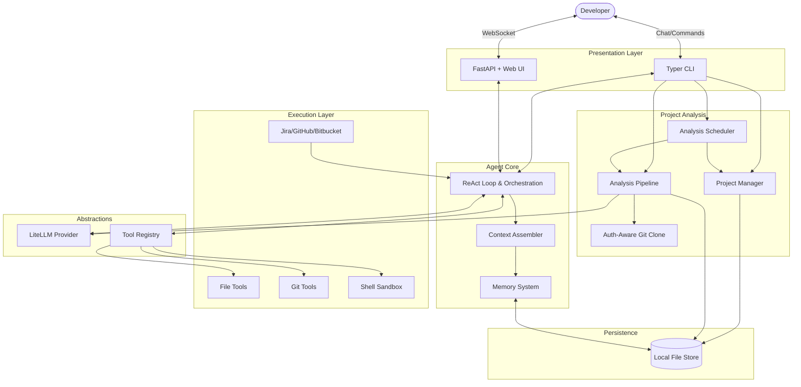

# WorkClaw Architecture & Implementation Design

WorkClaw is built as a self-hosted, modular "operating system" for AI developer agents. Its design is inspired by modern ReAct (Reason + Act) patterns and borrows conceptual boundaries from similar agentic tools like OpenClaw.

Below is a detailed breakdown of the system architecture, component responsibilities, and key design decisions.

---

## 1. High-Level Architecture

WorkClaw strictly separates **Intelligence** (the LLM provider) from **Execution** (tools and integrations) and **Presentation** (CLI/GUI). 

---

## 2. Core Components

### 2.1 The Agent Core (`workclaw.core.agent`)
The brain of the system is the `WorkClawAgent`. It implements a ReAct (Reason -> Act -> Observe) loop using an asynchronous generator. 

**Data Flow per User Request:**
1. **Context Assembly**: The `ContextAssembler` combines the system prompt, retrieved memory facts, and conversation history. It strictly manages token budgets using character-count heuristics to prevent context-window exhaustion.
2. **LLM Invocation**: The context and available tool schemas (JSON Schema) are sent to the LLM.
3. **Execution**: If the LLM requests a tool call (e.g., `git_clone` or `read_file`), the agent executes it locally and feeds the `ToolResult` back into the loop as an observation.
4. **Streaming**: Every state change (`THINKING`, `TOOL_CALL`, `TOOL_RESULT`, `RESPONSE`) is immediately yielded back to the calling interface (CLI/GUI) for real-time responsiveness.

### 2.2 LLM Abstraction (`workclaw.llm.provider`)
WorkClaw supports OpenAI, Anthropic, Google Gemini, and local Ollama models. Instead of writing separate clients for each, we use **LiteLLM**.
- **Unified Interface**: It translates standard `messages` arrays and OpenAI-formatted `tools` into the specific formats required by Anthropic or Gemini.
- **Provider Switching**: The architecture allows hot-swapping models via config without changing any agent logic.
- **Security Check**: We explicitly pinned the `litellm` package version to avoid a known software supply-chain vulnerability affecting versions `1.82.7-1.82.8`.

### 2.3 The Tool System (`workclaw.tools`)
Tools are discrete capabilities the LLM can invoke. They inherit from a base `Tool` class.
- **Safety First**: The `ShellTool` runs within a timed async subprocess and implements a blocklist against destructive commands like `rm -rf /`.
- **Introspection**: Every tool defines its own `description` and `parameters` (as JSON Schema). The `ToolRegistry` automatically compiles these into the OpenAI function-calling format at runtime.

### 2.4 Persistence (`workclaw.storage`)
WorkClaw is "local-first" and does not require a database like PostgreSQL.
- **No-DB Philosophy**: State is managed entirely through local files in `~/.workclaw/data/`.
- **Formats**: 
  - `JSON`: For conversation histories containing complex structured data (tool calls, arguments).
  - `YAML`: For config and simple key-value memory facts.
  - `Markdown`: For analysis reports.
- **Why?**: This makes the agent's memory entirely transparent to the developer. You can simply `cat ~/.workclaw/data/memory/facts.yaml` to see what WorkClaw "knows" about your project.

### 2.5 Presentation Layers (`workclaw.cli`, `workclaw.gui`)
WorkClaw provides two distinct user interfaces that consume the identical `WorkClawAgent` async generator.
- **CLI (`Typer` & `Rich`)**: Designed for quick, terminal-native interactions and scriptability.
- **GUI (`FastAPI` & `WebSockets`)**: Designed for extended coding sessions. The FastAPI server hosts an HTTP Server for static assets and an asynchronous WebSocket endpoint. The frontend (Vanilla JS) connects to this socket, parsing streaming events into interactive chat bubbles and expandable "Tool Call" diagnostic cards.

### 2.6 Project Management (`workclaw.projects`)
WorkClaw supports multi-repository projects for consolidated code analysis.
- **`ProjectConfig`**: A Pydantic model defining a project with a name, description, list of `RepoSource` entries, optional cron schedule, and analysis settings (max files per repo, focus areas).
- **`RepoSource`**: Defines a single repository with URL, provider (GitHub/Bitbucket/other), branch, and authentication method. URLs are validated and repo names are auto-derived.
- **`ProjectManager`**: CRUD operations for project configs, persisted as YAML via `FileStore` in `~/.workclaw/data/projects/`.
- **Auth-aware cloning**: Supports four `AuthMethod` values — `HTTPS` (public), `HTTPS_CREDENTIALS` (username + password from env var), `SSH_KEY` (explicit key path), and `SSH_AGENT` (system ssh-agent). The `git_clone` module builds the appropriate `GIT_SSH_COMMAND` or injects credentials into the URL.

### 2.7 Analysis Pipeline (`workclaw.analysis`)
Multi-repo analysis orchestrated by three cooperating classes:
- **`CodeAnalyzer`**: Analyzes individual files and entire repos using LLM prompts. Maps file extensions to languages, skips binary/generated directories (`__pycache__`, `node_modules`, `.git`, etc.), and respects configurable file size limits and focus areas.
- **`AnalysisPipeline`**: Takes a `ProjectConfig`, clones every repo into a workspace directory (shallow clone with `--depth 1`), runs `CodeAnalyzer` on each, then produces a consolidated markdown report via an LLM summarization pass. Per-repo results are saved as JSON alongside the consolidated report in `~/.workclaw/data/project_analysis/`.
- **`AnalysisScheduler`**: Wraps `APScheduler` to run periodic re-analysis. Reads projects with a `schedule_cron` field, registers cron jobs, and calls `AnalysisPipeline.analyze_project()` on each trigger. Manages its own lifecycle (`start`/`stop`).

---

## 3. Design Decisions & Best Practices

| Area | Decision | Rationale |
| :--- | :--- | :--- |
| **Language** | Python 3.11+ | Unmatched ecosystem for AI (LiteLLM, Langchain equivalents), robust CLI frameworks (`Typer`), and excellent async support (`FastAPI`, `asyncio`). |
| **Package Layout** | `src/` layout | Standard modern Python packaging practice; prevents import confusion when running tests and ensures the installed package is what's being tested. |
| **Config Mgmt** | `pydantic-settings` | Prevents runtime crashes from missing configuration. Enforces types, provides defaults, and cleanly merges OS environment variables with YAML files. |
| **HTTP Clients** | `httpx` | Native async support prevents the ReAct loop from blocking while fetching Jira stories or downloading GitHub repos. |
| **Code Analysis** | AST-agnostic (Regex/LLM over AST) | Using raw text + LLM prompts (rather than language-specific AST parsers) means WorkClaw can analyze Python, TypeScript, Java, and Go with zero new code required. |

---

## 4. Extension Principles (Phase 2 & Beyond)

WorkClaw was designed to be easily extensible.
- **Adding a new Tool**: Create a new class extending `Tool`, define its JSON schema parameters, and add a single line to register it in `app.py`/`server.py`.
- **Adding Slack/Teams Integration**: WorkClaw's event-stream design makes chatbots trivial. A Slack bot would simply instantiate `WorkClawAgent`, call `agent.run(slack_message.text)`, and post standard messages back to the Slack API whenever a `RESPONSE` event is yielded.
- **Adding a new Auth Method**: Extend `AuthMethod` in `projects/models.py` and add the corresponding clone-command builder in `projects/git_clone.py`.
- **Custom Analysis Prompts**: Add new prompt templates in `llm/prompts.py` and wire them into `CodeAnalyzer` or `AnalysisPipeline` for specialized analysis passes (e.g., security audits, dependency scanning).
